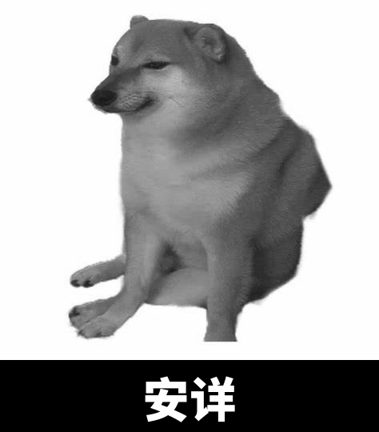
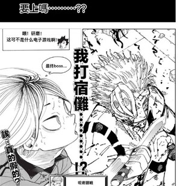
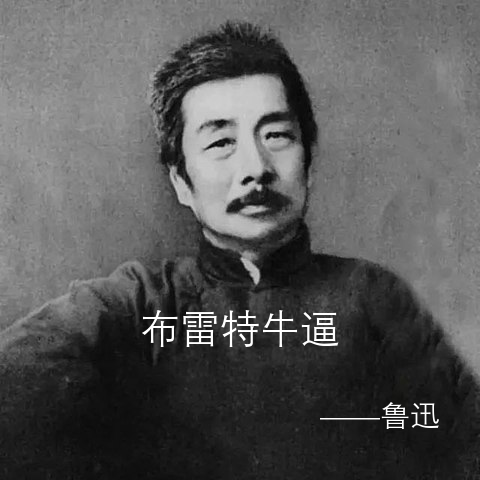
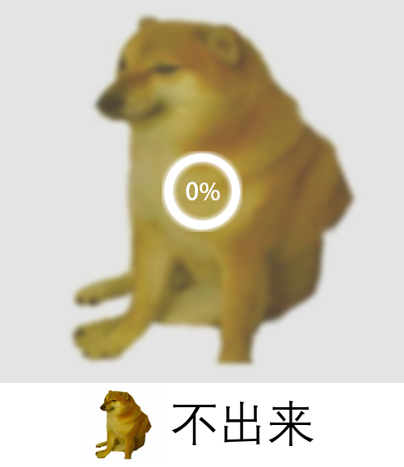
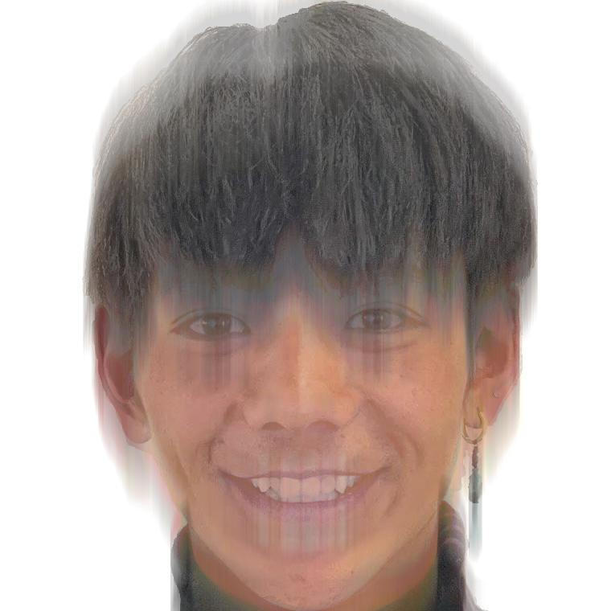
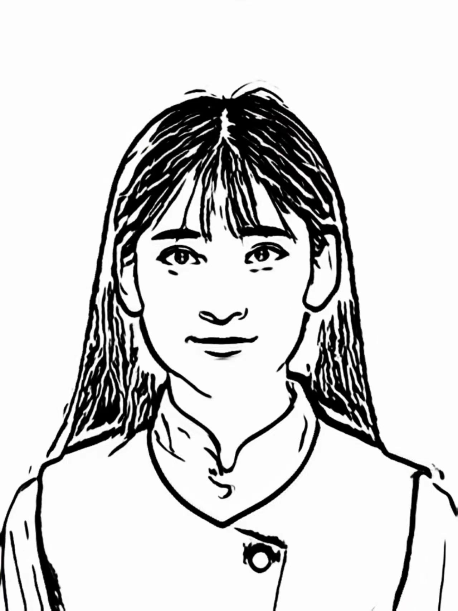
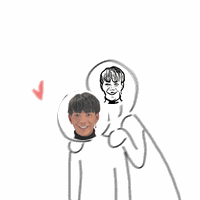
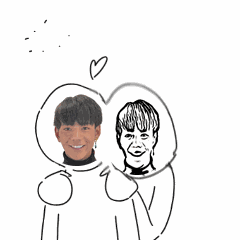
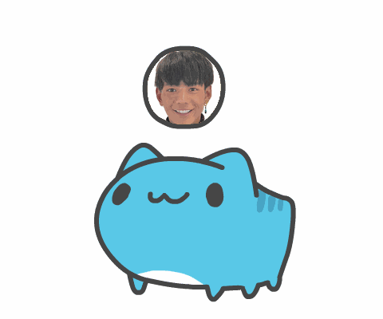

# 表情包模板·接口文档

+ **所有 Response 格式均为：**
  + 正确响应：`'code'` : 200，`'msg'` : 'ok'，`'result'` : bytes（Image）
  + 错误响应：`'code'` : 500，`'msg'` : 'Process Procedure Error: {`error`}'

### 图片表情包

|                          表情包模板                          |       路由        |                           Request                            |
| :----------------------------------------------------------: | :---------------: | :----------------------------------------------------------: |
|  |  `/aceattorney`   |                        `'text'` : str                        |
|  |    `/colorful`    |        `'text1'` : str   `'text2'` : str           |
|  |   `bluearchive`   |        `'text1'` : str   `'text2'` : str           |
|  |  `/graywordmeme`  |         `'img'` : bytes `'text'` : str             |
|  |     `/always`     |                       `'img'` : bytes                        |
|  |   `/fightsunuo`   |                       `'img'` : bytes                        |
|  |     `/luxun`      |                        `'text'` : str                        |
|  |     `/cannot`     |                       `'img'` : bytes                        |
|  | `/ecnublackboard` |                        `'text'` : str                        |
|  |    `/ecnulion`    |                        `'text'` : str                        |
|  |     `/trance`     |                       `'img'` : bytes                        |
|  |  `/bodysegment`   |                       `'img'` : bytes                        |
|    |    `/animegen`    | `'img'` : bytes `'type'` : str {'宫崎骏', '新海诚', '日本风', '素描风'} |

---

### GIF 表情包

|                          表情包模板                          |      路由      |                    Request                    |
| :----------------------------------------------------------: | :------------: | :-------------------------------------------: |
|  | `/chasetrain`  |                `'img'` : bytes                |
|  |   `/confuse`   |                `'img'` : bytes                |
|  | `/flashblind`  |  `'img'` : bytes `'text'` : str     |
|  | `/funnymirror` |                `'img'` : bytes                |
|  |   `/guichu`    |  `'img'` : bytes `'text'` : str     |
|  |    `/kiss`     | `'img1'` : bytes `'img2'` : bytes   |
|    |     `/rub`     | `'img1'` : bytes  `'img2'` : bytes  |
|  |    `/punch`    |                `'img'` : bytes                |
|   |     `play`     |                `'img'` : bytes                |

